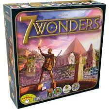

## <u>Projet informatique du Semestre 1 Master MIAGE</u>
##Sujet : Développer une version du jeu 7 Wonders pour quatre joueurs

### La Team :
- Fatima-Ezzahraa ELBARDI
- Moussa KONE
- Solomon LOURDESSAMY
- Rachida EL OUARIACHI
###Présentation du jeu 
7 Wonders est un jeu de cartes évolutif ayant pour thème le développement de civilisations autour de chacune des sept Merveilles du monde.

Il utilise une technique de construction où, à chaque tour, chaque joueur choisit une carte de sa main puis passe les cartes restantes à son voisin. Ceci se répète jusqu'à ce que 6 des 7 cartes initiales aient été jouées. Le jeu se joue avec trois paquets de cartes représentant trois âges de développement. À la fin de chaque âge, des conflits militaires sont résolus entre voisins.

Pendant la partie, le négoce des ressources nécessaires au développement est possible entre voisins immédiats. Quand les trois paquets de cartes ont été joués, les joueurs totalisent leurs points dans différents domaines (civil, scientifique, commercial, militaire, état d'avancement). Le joueur ayant le plus de points gagne la partie. 

##Cahier des charges 

####Présentation

Le but de ce projet est de réaliser une application client/serveur qui permettra à des joueurs de faire des parties endiablées de 7 Wonders.

7 Wonders est un jeu de société (le plus primé au monde) dont voici le résumé (extrait de https://www.didacto.com/jeux-de-strategie/4117-7-wonders-5425016923764.html) :

    Prenez la tête d'une cité du monde antique et développez la vers la victoire.

    Au début de la partie chaque joueur reçoit un plateau Merveille qui représente la cité antique qu'il devra gérer au cours du jeu.
    Chacun leur tour, les joueurs construisent un ou plusieurs bâtiments dans leur cité.

    Pour construire un bâtiment, le joueur doit avoir les ressources nécessaires.
    Celles-ci sont fournies par les bâtiments de production de matières premières ou manufacturées déjà construits dans la cité ou par du commerce avec les autres joueurs.

    Certains bâtiments peuvent être construits gratuitement si le joueur possède déjà le ou les bâtiments prérequis.
    Par exemple, on peut construire l'académie gratuitement si on possède déjà l'école.

    De multiples bonus seront obtenus pendant la partie en se concentrant sur le développement d'une armée, des merveilles de sa cité, de la science, du commerce, etc.

    Choisissez donc judicieusement quels aspects de votre ville privilégier pour qu'elle prospère avant celles de vos adversaires.

Contraintes imposées

    Gameplay
        Uniquement des parties à 4 joueurs (on ne garde que les cartes marquées 3+ et 4+)
        Uniquement la face A du plateau Merveille de chaque joueur
    Technique
        Client en JFX
        Back-end en RMI Java
        Historisation des parties et sauvegarde en MongoDB
    Ergonomie
        Possibilité de consulter une partie à laquelle on a participé. Il sera possible de consulter chaque action réalisée durant la partie, un peu comme aux échecs sur chess.com

Détails sur l'application

L'idée est de construire une plate-forme à laquelle on peut s'inscrire.

    1-Un joueur inscrit pourra créer une partie et inviter d'autres joueurs, inscrits également, à le rejoindre (3 obligatoirement). Les joueurs patientent dans une salle d'attente en attendant que tout le monde arrive. Une fois que tout le monde est là, la partie commence. 
    2-Le créateur de la partie peut à tout moment stopper la partie. La partie sera alors sauvegardée, les joueurs seront redirigés vers le menu principal de l'application. Le créateur pourra plus tard relancer la partie (imposant ainsi le "même" chemin qu'à la création i.e. invitations automatiquement envoyées, salle d'attente, reprise de la partie dans l'état où elle s'était arrêtée). 

##Guide d'installation 
#### Outils requis

#### Installation de Java pour faire du JFX 

- Tuto d'installation : https://www.youtube.com/watch?v=_WzAA_HyP6c&t=7s

- Étapes

- 1 - Installation du JDK Java
- 2 - Installation de l'IDE IntelliJ
- 3 - Installation de Scene Builder
- 4 - Installation du SDK pour JAVAFX
- 4 - Créer un archetype pour permettre de créer un projet démo JFX

####Installation du conteneur Docker pour l'accès à la base de données
  
- Étapes

- 1 - Décompresser l’archive 7Wonders.json.zip dans le dossier /tmp/<votreRepo>/data
- 2 - Lancer une nouvelle instance d'un serveur mongoDB avec Docker, exécuter dans un terminal :
   ######docker run --name mongoserver -d mongo
- 3 - Lancer un nouveau conteneur docker qui importe ce fichier json (pensez au -v !) dans mongo
   ######docker run -it --link mongoserver:mongo --rm -v /tmp/<votreRepo>/data:/data mongo bash
- 4 - Puis dans ce container, lancer l'importation des données :
   ######mongoimport --db dblp --collection publis --host mongo --port 27017 --file
   /data/7Wonders.json --jsonArray

#### Liens vers les sites pour l'installation de l'environnement

- Java FX
- Pour le JDK:https://www.oracle.com/java/technologies/downloads/
- Pour IntelliJ:https://www.jetbrains.com/idea/promo/?source=google&medium=cpc&campaign=9736964302&gclid=CjwKCAiA_omPBhBBEiwAcg7smR82ELU8EVtDbdtoZXJVtzqJ-dCGoNBd0sJMlVwOcKQdgN4yRD6qxBoCLUsQAvD_BwE
- Pour SceneBuilder:https://gluonhq.com/products/scene-builder/
- Pour JAVAFX:https://gluonhq.com/products/javafx/
- Pour le Docker:https://docs.docker.com/get-docker/

##Implémentation de la solution 

### Structure du projet

### Modèle

###Fonctionnalités du cahier des charges implementées
- 1 - Création d'une plateforme d'inscription des différents joueurs
- 2 - Possibilité pour chaque joueurs de créer une partie et d'envoyer un lien de connexion à la partie aux      autres joueurs à l'aide d'un token(invitation)
- 3 - Distribution aléatoire des plateaux aux différents joueurs
- 4 - Circulation des cartes entre tous les joueurs
- 5 - Changement du sens de circulation des cartes entre tous les joueurs selon les ages
- 6 - Choix pour chaque joueurs de mettre une carte soit dans la défausse,soit dans la construction d'une       merveille ou soit dans la construction de la cité et ce pour tous les ages
- 7 -  Ajout des contraintes pour ajouter une carte dans la construction de cité,la construction de merveille
- 8 -  Possibilité pour l'admin de la partie de mettre en pause,d'arreter ou de quitter la partie(ce qui  mettra fin à la partie)
- 9 -  Enregistrement de l'Etat des parties et possibilité pour l'admin de reprendre une partie 
- 10 -  Enregistrement de toutes les parties effectuées(historisation)
- 11 - Détermination du gagnant en fin de partie
###Fonctionnalités du cahier des charges à implementer à l'avenir(Pas Disponible)
- 1 - Ajout d'autres types de contraintes pour ajouter une carte dans la construction de cité,la construction de merveille
- 2 - Classement des joueurs en fin de partie

###Design pattern utilisés 
- 1 - Observateur
- 2 - 
- 3 -
###Liens vers la bibliographie complète

####------------>https://fr.wikipedia.org/wiki/7_Wonders