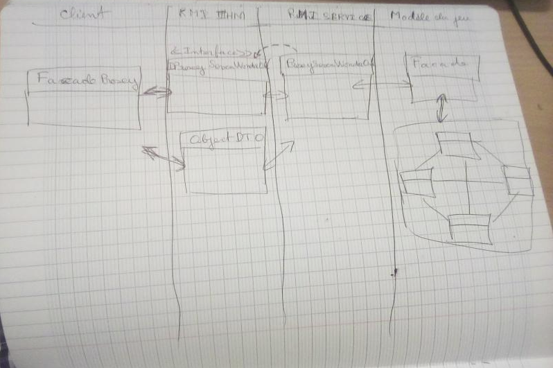

## <u>Projet informatique du Semestre 1</u>


Les données dans le mongoDB:

```javascript
use sevenwonders;
db.cartes.insert({"nom" : "militaire", "couleur" : "rouge", "valeur" : 5});
db.cartes.insert({"nom" : "brique", "couleur" : "orange", "valeur" : 4});
db.cartes.insert({"nom" : "pierre", "couleur" : "gris", "valeur" : 4});
```

<u>Structure du projet.</u>



