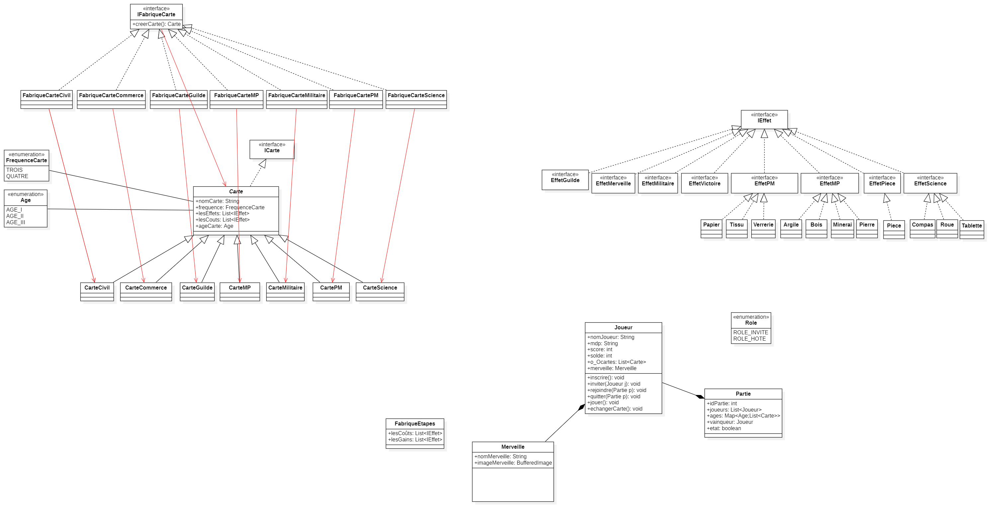

## <u>Projet informatique du Semestre 1 Master MIAGE</u>
##Sujet : Développer une version du jeu 7 Wonders

### La Team :
- Fatima-Ezzahraa ELBARDI
- Moussa KONE
- Solomon LOURDESSAMY
- Rachida EL OUARIACHI

### Les Outils & Technologies :
- Docker compose
- JAVA :
    * RMI
    * JFX
- BDD :
    * NoSQL : MangoDB
    * SQL : MySQL

### Les Design Patterns utilisés :
- MVC
- JDBC : DAO
- Strategy
- Factory
- Observer

### Les données dans le mongoDB:

```javascript
use sevenwonders;
db.cartes.insert({"nom" : "militaire", "couleur" : "rouge", "valeur" : 5});
db.cartes.insert({"nom" : "brique", "couleur" : "orange", "valeur" : 4});
db.cartes.insert({"nom" : "pierre", "couleur" : "gris", "valeur" : 4});
```

### <u>Structure du projet.</u>



